# Diagrama entidad-relacion - Base OSINT ML1

Estado: 2026-05-30

Este diagrama representa la estructura actual de `data/processed/database.sqlite`. La base importa tablas crudas de varias fuentes y una tabla analitica central; por eso no existen claves foraneas fisicas en SQLite todavia. Las relaciones propuestas son logicas y sirven para construir `master_table`, features y el dashboard.

Nota tecnica: `build_database.py` normaliza los nombres fisicos de columnas a formato SQLite seguro, en minusculas y con guiones bajos. Algunos nombres del diagrama conservan el significado de origen, pero la consulta real en SQLite debe usar los nombres normalizados.

---

## Diagrama ER conceptual

```mermaid
erDiagram
    MASTER_TABLE {
        date event_date PK
        string region PK
        int total_fatalities
        int event_count
        int gdelt_mentions
        int gdelt_articles
        float avg_tone
        int material_conflict_events
        int high_conflict_events
        int rss_article_count
        float rss_urgency_score
        int gdeltcloud_event_count
        int gdeltcloud_conflict_event_count
        int gdeltcloud_fatality_event_count
        int gdeltcloud_article_count
        float gdeltcloud_avg_goldstein_severity
        int iranwarlive_strike_count
        int iranwarlive_airspace_updates
        int iranwarlive_airspace_restrictions
        int iranwarlive_ground_event_count
        int iranwarlive_diplomacy_event_count
        float conflictsapp_escalation
        int conflictsapp_event_count
        int conflictsapp_high_severity_count
        int conflictsapp_military_event_count
        int target_total_fatalities
        int target_gdeltcloud_fatalities
        int target_iranwarlive_strike_casualties
        float target_attack_mortality_rate
        int target_conflictsapp_daily_deaths_estimate
        int target_alert_level
    }

    EVENT_MODEL_TABLE {
        string event_id PK
        date event_date
        string source
        string country
        string region
        string location
        float latitude
        float longitude
        string actor1
        string actor2
        string event_type
        string sub_event_type
        string weapon_type
        string target_type
        string civilian_targeting
        boolean attack_like_event
        int fatalities
        float target_msi
        boolean has_fatalities
        string confidence
        string source_url
        string text
    }

    ACLED_IRAN {
        string event_id_cnty PK
        date event_date
        string country
        string admin1
        string location
        float latitude
        float longitude
        string event_type
        string sub_event_type
        string actor1
        string actor2
        int fatalities
        string source
    }

    ACLED_ISRAEL {
        string event_id_cnty PK
        date event_date
        string country
        string admin1
        string location
        float latitude
        float longitude
        string event_type
        string sub_event_type
        string actor1
        string actor2
        int fatalities
        string source
    }

    GDELT_CLOUD_SUMMARY_IRAN_2026 {
        date key PK
        string group_by
        int event_count
        int conflict_event_count
        int fatality_event_count
        int fatalities
        float fatality_event_rate
        int article_count
        float avg_significance
        float avg_goldstein_scale
        float avg_confidence
        string query_country
        date window_start
        date window_end
    }

    GDELT_CLOUD_EVENTS_IRAN_2026 {
        string id PK
        string url
        string primary_story_url
        string family
        string title
        string summary
        date event_date
        string category
        string subcategory
        string event_code
        string actors
        boolean has_fatalities
        int fatalities
        string geo_country
        string geo_location
        float geo_latitude
        float geo_longitude
        float metrics_significance
        float metrics_goldstein_scale
    }

    IRANWARLIVE_STRIKES {
        string Event_ID PK
        datetime Timestamp
        float Latitude
        float Longitude
        string Strike_Type
        string Target_Description
        string Source_URL
        string Verified_By
        int Casualties
        string Escalation_Context
    }

    IRANWARLIVE_AIRSPACE {
        datetime Timestamp
        string Country
        string Status
        string Source_URL
    }

    IRANWARLIVE_POSTURING {
        datetime Timestamp
        string Country
        string Stance
        string Statement_Summary
        string Source_URL
    }

    IRANWARLIVE_PARTICIPANTS {
        string Country PK
        string Alliance
        string Est_Troops
        string Est_Aircraft
        string Est_Armor
        int Military_Deaths
        int Civilian_Deaths
        string Status
    }

    IRANWARLIVE_GROUND_FEED {
        string event_id PK
        string type
        string location
        datetime timestamp
        string confidence
        string units_involved
        string movement_direction
        string territory_control
        string event_summary
        string source_url
        int osint_meta_casualties
        float osint_meta_lat
        float osint_meta_lng
    }

    IRANWARLIVE_DIPLOMACY_FEED {
        string event_id PK
        datetime timestamp
        string event_type
        string actor
        string statement_summary
        string full_detail
        string source_url
        string significance
        string ceasefire_impact
    }

    IRANWARLIVE_HORMUZ_FEED {
        datetime last_updated
        date today PK
        string current_status
        int ships_today
        float oil_transit_mbpd
        int incident_count
        float insurance_rate
        string notes
    }

    IRANWARLIVE_MACHINE_FEED {
        datetime last_updated
        int item_count
    }

    CONFLICTSAPP_BOOTSTRAP {
        string conflictid PK
        string conflictname
        int days
        string status
        string threatlevel
        float escalation
    }

    CONFLICTSAPP_CONFLICT {
        string id PK
        string name
        date startdate
        string status
        string threatlevel
        string region
        float escalation
        string summary
    }

    CONFLICTSAPP_DAYS {
        date day PK
        string daylabel
        string summary
        float escalation
        int casualties_iran_killed
        int casualties_iran_injured
        int casualties_israel_kia
        int casualties_us_kia
        int casualties_lebanon_killed
        string economicimpact_narrative
    }

    CONFLICTSAPP_EVENTS {
        string id PK
        datetime timestamp
        string severity
        string type
        string title
        string location
        string summary
        boolean verified
        string tags
    }

    CONFLICTSAPP_ACTORS {
        string id PK
        string name
        string fullname
        string countrycode
        string type
        string affiliation
        string activitylevel
        float activityscore
        string stance
        string assessment
    }

    CONFLICTSAPP_MAP_STRIKES {
        string id PK
        string sourceeventid
        string actor
        string priority
        string category
        string type
        string status
        datetime timestamp
        string from
        string to
        string label
        string severity
    }

    CONFLICTSAPP_MAP_MISSILES {
        string id PK
        string sourceeventid
        string actor
        string priority
        string category
        string type
        string status
        datetime timestamp
        string from
        string to
        string label
        string severity
    }

    CONFLICTSAPP_MAP_TARGETS {
        string id PK
        string sourceeventid
        string actor
        string priority
        string category
        string type
        string status
        datetime timestamp
        string position
        string name
        string description
    }

    CONFLICTSAPP_MAP_HEATPOINTS {
        string id PK
        string sourceeventid
        string actor
        string priority
        string position
        float weight
    }

    CONFLICTSAPP_MAP_ASSETS {
        string id PK
        string sourceeventid
        string actor
        string priority
        string category
        string type
        string status
        datetime timestamp
    }

    CONFLICTSAPP_MAP_THREATZONES {
        string id PK
        string sourceeventid
        string actor
        string priority
        string category
        string type
        datetime timestamp
        string coordinates
    }

    ACLED_IRAN }o--|| MASTER_TABLE : "agrega por event_date + region=iran"
    ACLED_ISRAEL }o--|| MASTER_TABLE : "agrega por event_date + region=israel"
    ACLED_IRAN }o--|| EVENT_MODEL_TABLE : "eventos historicos con MSI"
    ACLED_ISRAEL }o--|| EVENT_MODEL_TABLE : "eventos historicos con MSI"
    GDELT_CLOUD_SUMMARY_IRAN_2026 ||--o{ MASTER_TABLE : "se une por key/event_date + region=iran"
    GDELT_CLOUD_EVENTS_IRAN_2026 }o--|| GDELT_CLOUD_SUMMARY_IRAN_2026 : "agrega por event_date"
    GDELT_CLOUD_EVENTS_IRAN_2026 }o--|| EVENT_MODEL_TABLE : "eventos 2026 con fatalities/MSI"
    IRANWARLIVE_STRIKES }o--|| MASTER_TABLE : "features por fecha"
    IRANWARLIVE_STRIKES }o--|| EVENT_MODEL_TABLE : "strikes 2026 con casualties/MSI"
    IRANWARLIVE_AIRSPACE }o--|| MASTER_TABLE : "restricciones por fecha/pais"
    IRANWARLIVE_POSTURING }o--|| MASTER_TABLE : "postura por fecha/pais"
    IRANWARLIVE_PARTICIPANTS ||--o{ IRANWARLIVE_STRIKES : "contexto por pais"
    IRANWARLIVE_GROUND_FEED }o--|| MASTER_TABLE : "eventos por fecha"
    IRANWARLIVE_DIPLOMACY_FEED }o--|| MASTER_TABLE : "senales diplomaticas por fecha"
    IRANWARLIVE_HORMUZ_FEED }o--|| MASTER_TABLE : "senal maritima por fecha"
    IRANWARLIVE_MACHINE_FEED }o--|| MASTER_TABLE : "senal automatizada por fecha cuando tenga items"
    CONFLICTSAPP_BOOTSTRAP ||--|| CONFLICTSAPP_CONFLICT : "metadata del conflicto"
    CONFLICTSAPP_DAYS ||--o{ MASTER_TABLE : "escalation por day/event_date"
    CONFLICTSAPP_EVENTS }o--|| CONFLICTSAPP_DAYS : "agrega por timestamp/day"
    CONFLICTSAPP_CONFLICT ||--o{ CONFLICTSAPP_DAYS : "dias del conflicto"
    CONFLICTSAPP_EVENTS ||--o{ CONFLICTSAPP_MAP_STRIKES : "sourceeventid/id"
    CONFLICTSAPP_EVENTS ||--o{ CONFLICTSAPP_MAP_MISSILES : "sourceeventid/id"
    CONFLICTSAPP_EVENTS ||--o{ CONFLICTSAPP_MAP_TARGETS : "sourceeventid/id"
    CONFLICTSAPP_EVENTS ||--o{ CONFLICTSAPP_MAP_HEATPOINTS : "sourceeventid/id"
    CONFLICTSAPP_EVENTS ||--o{ CONFLICTSAPP_MAP_ASSETS : "sourceeventid/id"
    CONFLICTSAPP_EVENTS ||--o{ CONFLICTSAPP_MAP_THREATZONES : "sourceeventid/id"
    CONFLICTSAPP_ACTORS ||--o{ CONFLICTSAPP_EVENTS : "actor/contexto"
```

---

## Entidades principales

| Entidad | Rol en el proyecto |
|---|---|
| `master_table` | Tabla analitica diaria por fecha-region para features agregadas y dashboard |
| `event_model_table` | Tabla analitica por evento para modelar severidad de mortalidad (`target_msi = log(1 + fatalities)`) |
| `acled_iran`, `acled_israel` | Ground truth principal de eventos/fatalities |
| `gdeltcloud_summary_iran_2026` | Features diarias de conflicto, cobertura y severidad mediatico-operacional |
| `gdeltcloud_events_iran_2026` | Eventos detallados de GDELT Cloud para auditoria y enriquecimiento |
| `iranwarlive_*` | Fuente OSINT auxiliar para strikes, airspace, posturing, diplomacy, Hormuz y ground ops |
| `conflictsapp_*` | Fuente OSINT auxiliar para metadata del conflicto, snapshots diarios, escalamiento, eventos, actores y capas de mapa |

---

## Llaves logicas recomendadas

| Relacion | Llave |
|---|---|
| ACLED -> `master_table` | `event_date` + `region` |
| ACLED -> `event_model_table` | `event_id_cnty` como `event_id`, `fatalities` como base de `target_msi` |
| GDELT Cloud summary -> `master_table` | `key` como `event_date` + `query_country` como `region` |
| GDELT Cloud events -> summary | `event_date` |
| GDELT Cloud events -> `event_model_table` | `id` como `event_id`, `fatalities` como base de `target_msi` |
| IranWarLive strikes -> `master_table` | fecha derivada de `Timestamp` |
| IranWarLive strikes -> `event_model_table` | `Event_ID` como `event_id`, `Casualties` como base de `target_msi` |
| IranWarLive airspace/posturing -> `master_table` | fecha derivada de `Timestamp` + `Country` |
| IranWarLive participants -> otros IranWarLive | `Country` |
| Diplomacy/Ground/Hormuz -> `master_table` | fecha derivada de `timestamp` o `today` |
| IranWarLive machine feed -> `master_table` | fecha derivada de `last_updated` cuando existan items |
| Conflicts.app bootstrap -> conflict | `conflictid` / `id` |
| Conflicts.app days -> `master_table` | `day` como `event_date`, region `iran` o `global` |
| Conflicts.app conflict -> days | `id` como contexto del conflicto |
| Conflicts.app events -> days | fecha derivada de `timestamp` |
| Conflicts.app map layers -> events | `sourceeventid` cuando existe; si no, fecha derivada de `timestamp` |
| Conflicts.app actors -> events/map | `id`, `actor`, `affiliation` como contexto categorico |

---

## Proxima mejora de modelo de datos

La base final deberia evolucionar hacia estas tablas procesadas:

| Tabla futura | Proposito |
|---|---|
| `dim_region` | Normalizar `iran`, `israel`, `global`, coordenadas y aliases |
| `fact_conflict_events` | Eventos unificados ACLED + GDELT Cloud + IranWarLive |
| `fact_media_signals_daily` | Conteos, tono, confianza y significancia diaria |
| `fact_osint_signals_daily` | Airspace, Hormuz, posturing, strikes y ground operations agregados |
| `fact_model_features_daily` | Tabla limpia final para ML |
| `fact_model_predictions` | Predicciones exportables al dashboard |
